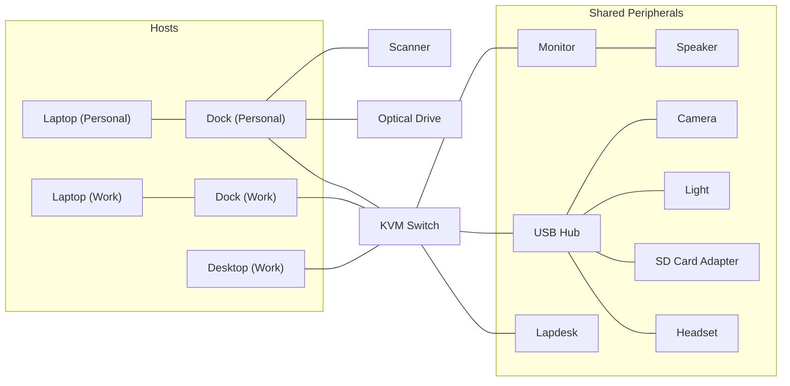
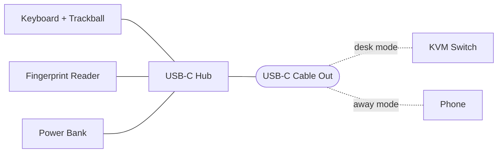

# Desk Setup

A diagram of my physical desk hardware — how machines, docks, the KVM, and shared peripherals are wired together. Modeled subsystem by subsystem; nodes are kept generic so the diagram stays readable, with the specific products listed in the reference tables below each one.

## Workstation Topology

A KVM sits at the center, switching one set of shared peripherals between hosts. Every host presents both display and USB to the KVM, and the KVM switches the two together — so a single keyboard, pointer, display, and USB set follow whichever machine is active. Each line below carries both signals.

- **Hosts** (left) reach the KVM through a dock — except the work desktop, which has no dock and connects directly.
- **Audio** is embedded in the DisplayPort signal, so it follows the active host through the KVM; the monitor extracts it and drives the speaker over a 3.5mm aux cable.
- **The light** is the one hub device that only draws power; everything else on the hub is data that switches with the active host.
- **The lapdesk** plugs in as another shared peripheral — in desk mode its USB-C out cable lands at the KVM (see [Portable Lapdesk](#portable-lapdesk)).
- **Not KVM-shared:** the scanner and Blu-ray writer hang off the personal laptop's dock rather than the shared hub, so switching the KVM to another machine can't interrupt a long scan or disc rip/burn. The printer is on Wi-Fi, reachable by any host over the LAN regardless of the active KVM input.

### Workstation Hardware

| Diagram node | Device | Product |
|---|---|---|
| Camera | Logitech C920S HD Pro (1080p, privacy shutter) | [Amazon][camera] |
| Desktop (Work) | _Intentionally omitted_ | — |
| Dock (Personal) | Anker PowerExpand+ 11-in-1 | [Amazon][anker11] |
| Dock (Work) | _Intentionally omitted_ | — |
| Headset | Plantronics Blackwire 3210 (mono, USB-C w/ USB-A adapter) | [Amazon][headset] |
| KVM Switch | Level1Techs DisplayPort 1.4 KVM (single monitor, four computer) | [Level1Techs][kvm] |
| Laptop (Personal) | Microsoft Surface Book 2 | [Microsoft Support][surfacebook2] |
| Laptop (Work) | _Intentionally omitted_ | — |
| Light | Melifo Curved Monitor Light Bar | [Amazon][light] |
| Monitor | Deco Gear 43" Curved Ultrawide (DGVIEW430) | [Amazon][ultrawide] |
| Optical Drive | LG WH12LS39 + Fideco S3G-PL03 USB adapter | [Newegg][optical] + [Amazon][fideco] |
| Scanner | Brother ADS-1200 | [Amazon][scanner] |
| SD Card Adapter | Rocketek USB 3.0 4-Slot SD Card Reader | [Amazon][sdreader] |
| Speaker | Yamaha SR-C20A | [Amazon][speaker] |
| USB Hub | Plugable USB 2.0 10-Port Hub | [Amazon][usbhub] |
| — | Brother HL-2270DW (Wi-Fi printer) | [Amazon][printer] |

_The Wi-Fi printer (—) isn't in the diagram — it reaches any host over the LAN, not through the KVM._

[anker11]: https://www.amazon.com/Anker-PowerExpand-Adapter-Delivery-Ethernet/dp/B08NDGD2V5
[camera]: https://www.amazon.com/Logitech-C920S-Pro-HD-Webcam/dp/B07K986YLL
[fideco]: https://www.amazon.com/Adapter-FIDECO-Converter-5-25-Inch-DVD-ROM/dp/B077N2KK27
[headset]: https://www.amazon.com/Plantronics-Blackwire-USB-C-Headset-Wired/dp/B0775K15F4
[kvm]: https://www.store.level1techs.com/products/p/14-display-port-kvm-single-4computer-6zepx-s4kf3
[light]: https://www.amazon.com/MELIFO-Wireless-Computer-Stepless-Backlight/dp/B09FHMPFW1
[optical]: https://www.newegg.com/lg-wh12ls39-internal-blu-ray-burner/p/N82E16827136241
[printer]: https://www.amazon.com/Brother-HL-2270DW-Compact-Wireless-Printing/dp/B00JJ3M2U0
[scanner]: https://www.amazon.com/Brother-Compact-ADS-1200-Professionals-ADS1200/dp/B07WSJQWVQ
[sdreader]: https://www.amazon.com/Reader-Rocketek-Memory-Flexible-memory/dp/B00GXPTRKU
[speaker]: https://www.amazon.com/Yamaha-SR-C20A-Compact-Subwoofer-Bluetooth/dp/B08DZX69CY
[surfacebook2]: https://support.microsoft.com/en-us/surface/models/surface-book-2-specs-and-features
[ultrawide]: https://www.amazon.com/Deco-Gear-Curved-Ultrawide-Monitor/dp/B07XJZ3W4Z
[usbhub]: https://www.amazon.com/Plugable-10-Port-Speed-Adapter-Flip-Up/dp/B00483WRZ6

## Portable Lapdesk

A self-contained input cluster on a lapdesk. Its devices share one USB-C hub, whose single upstream cable plugs into the KVM at the desk or the Pixel when working away.

The power bank plays no role at the desk; the KVM powers the cluster there. It exists only for away mode, where it feeds power into the USB-C hub — charging the Pixel and running the cluster so the phone becomes a pocket workstation. Its MagSafe face can deliver wireless power, but here it serves only as a magnetic mount — anchoring the charger to the lapdesk while keeping it easy to detach and carry separately. Power runs over USB-C instead.

### Portable Lapdesk Hardware

| Diagram node | Device | Product |
|---|---|---|
| Fingerprint Reader | Kensington VeriMark Desktop | [Amazon][verimark] |
| Keyboard + Trackball | ZSA Voyager + Navigator | [Voyager][voyager] + [Navigator][navigator] |
| Phone | Google Pixel 10 Pro Fold | [Google Store][pixel] |
| Power Bank | INIU MagSafe Power Bank | [Amazon][iniu] |
| USB-C Hub | VANGREE 4-Port USB-C Hub | [Amazon][vangree] |

[iniu]: https://www.amazon.com/INIU-Slimmest-10000mAh-Certified-Magnetic/dp/B0G4W34KG5
[navigator]: https://www.zsa.io/voyager/navigator
[pixel]: https://store.google.com/product/pixel_10_pro_fold
[vangree]: https://www.amazon.com/VANGREE-Splitter-Multiport-MacBook-Monitor/dp/B0D5VTBG8F
[verimark]: https://www.amazon.com/Kensington-VeriMark-Desktop-Fingerprint-Reader/dp/B08WPHWN83
[voyager]: https://www.zsa.io/voyager

### Portable Lapdesk Gotchas

- The keyboard connects through the lapdesk's USB hub, so the KVM's HID port never sees it as a direct HID device. That disables the KVM's keyboard-shortcut switching from the lapdesk — inputs have to be changed with the KVM's buttons instead.

## Power & Backup

The desk runs off a single UPS for battery backup and surge protection. (The lapdesk's away mode runs on its own power bank, not the UPS.)

| Device | Product |
|---|---|
| APC Back-UPS Pro 1500 (BX1500M) | [Amazon][ups] |

[ups]: https://www.amazon.com/APC-Battery-Protector-BackUPS-BX1500M/dp/B06VY6FXMM
